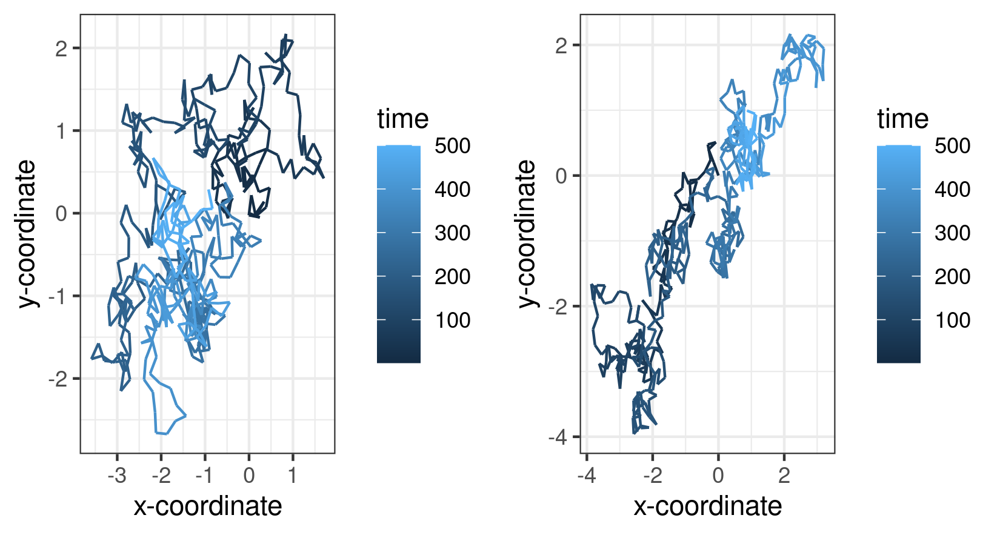

# Reproducible research: version control and R

# Answers # 
\# Link to logistic_growth repository
https://github.com/Felix-Smyth/logistic_growth #

## Question 4 ##
### a) What is observed after the random walk code execution? ###
The two plots produced from the code show two stochastic paths undertaken, both from the same function but ran twice. The plots each show a pathway for a particle on a two dimensional plane denoted by x ordinates and y ordinates respectively. The starting position of the particle is denoted by the coordinates(0,0), allowing any deviations from this position at any point in time to be found using the coordinates of the x and y axis. 

The notation of the x and y axis are relative to the starting position of the particle, which is maintained as (0,0). Wherever the random path traces to, determines the minimum and maximum coordinates of each of the axes. 

Along the length of the path line taken by each plot, the colour of the line experiences a colour gradient change from dark blue to light blue. This change is proportional to the amount of time elapsed since the random walk began and also the length of the line, as the particle has a constant speed. As a result, the colour of the line at any point can be compared to the legend gradient to estimate at which point in time the random walk crossed a specific coordinate. Both random walks finish at a time of 500 units. 

Every step of the random walk motion is made of a straight line as seen below. Each of the particles in the two plots move a distance 0.25 on the coordinate scale per unit time. The randomised component of the model is the angle in which this occurs at any specified time interval. This explains why the plots are different for each successive running of the model as it would be probabalistically extremely unlikely that a perfect replica path was generated. 

Data and code have since been edited in order to complete the next steps of this Assignment

### b) What is a random seed and how does it work? ###
A random seed is the starting input of the generation of a random number by a computer. As a true random number cannot be generated, pseudo-randomisation can be done instead using algorithms. A random seed is a number used to begin this process of pseudo-randomisation and acts as the deterministic part of the generation process. The same random seed, when put into a random number generator, will produce the same number output each time. However, which random number is generated is for each seed is much harder to predict and requires knowledge of the algorithm steps that the computer uses to produce a pseudo-random number as an output. 

The fact that a seed produces the same random number output each time when ran means that knowledge of the random seed used in an experiment or model allows for replicable results. With knowledge of the random seed used and the pseudo-random algorithm, other individuals running a length of code can completely replicate the choices and data of the original author. 

A very simplistic random number generator model for understanding (major oversimplification) is the idea of a sine wave function that has been compressed almost infinitely on the x axis scale while the Y axis scale lies between 0 and 1. For a specific random seed (a number somewhere along the x axis) the function produces the same pseudo random probability value between 0 and 1 for each repetition. However different values along the x axis produce very different y values in an almost random fashion. 

### c) Reproduceable Brownian motion ###
Edit the script to make a reproducible simulation of Brownian motion. Commit the file and push it to your forked reproducible-research_homework repo

Assuming that Brownian motion still occurs in the 2D plane specified already in the code and not in a 3D space. Brownian motion describes random particle movement in space over time which can be modelled as random walk as particles are not able to teleport. Incorporation of a random seed in order to identify the specific output of the random walk generator. 

### d) Showing commit history ###
This commit history is for the dev branch of the forked repository as I will commit and push to the main branch when everything is complete. 

Commit history of the reproducible random walk file in order to make it reproducible with the addition of a random seed

## Question 5 ##
### a) How many rows and columns does the Cui_etal2014.csv have? ###
Excluding the column name row, the data has 33 rows and 13 columns. 

### b) What transformation can you use to fit a linear model to the data? ###
A log tranformation can be used to fit a linear model to the data of the realtionship between genome length and virion volume. 

### c) Find the exponent (β) and scaling factor (α) of the allometric law for dsDNA viruses and write the p-values from the model you obtained, are they statistically significant? Compare the values you found to those shown in Table 2 of the paper, did you find the same values? ###

Exponent (β) has a value of 1.5152 with a p value of 6.44 x10^(-10)

Scaling factor (α) has a value of 1181.807 with a p value of 2.28 x10^ (-10)

Both values are very statistically significant and the value of both the scaling factor and exponent match that of Table 2 of the paper. 

### d) Write the code to reproduce the figure ### 
Code can be found in the virion_sizes.R file but attached below is a copy of the plot. 

### e) Calculate the estimated volume of a viral particle with a genome length of 300kb ###
Use of the provided equation and the estimated values of the exponent and scaling factor from the linear model

Volume of virion calculated to be 6697006 or 6.70 x10^6 (3sf) 

This value looks to be in the right region, judging from the graph at the bottom of the README.md file

# Assignment #
## Instructions ##

The homework for this Computer skills practical is divided into 5 questions for a total of 100 points. First, fork this repo and make sure your fork is made **Public** for marking. Answers should be added to the # INSERT ANSWERS HERE # section above in the **README.md** file of your forked repository.

Questions 1, 2 and 3 should be answered in the **README.md** file of the `logistic_growth` repo that you forked during the practical. To answer those questions here, simply include a link to your logistic_growth repo.

**Submission**: Please submit a single **PDF** file with your candidate number (and no other identifying information), and a link to your fork of the `reproducible-research_homework` repo with the completed answers. All answers should be on the `main` branch.

## Assignment questions 

1) (**10 points**) Annotate the **README.md** file in your `logistic_growth` repo with more detailed information about the analysis. Add a section on the results and include the estimates for $N_0$, $r$ and $K$ (mention which *.csv file you used).
   
2) (**10 points**) Use your estimates of $N_0$ and $r$ to calculate the population size at $t$ = 4980 min, assuming that the population grows exponentially. How does it compare to the population size predicted under logistic growth? 

3) (**20 points**) Add an R script to your repository that makes a graph comparing the exponential and logistic growth curves (using the same parameter estimates you found). Upload this graph to your repo and include it in the **README.md** file so it can be viewed in the repo homepage.
   
4) (**30 points**) Sometimes we are interested in modelling a process that involves randomness. A good example is Brownian motion. We will explore how to simulate a random process in a way that it is reproducible:

   a) A script for simulating a random_walk is provided in the `question-4-code` folder of this repo. Execute the code to produce the paths of two random walks. What do you observe? (10 points) \
   b) Investigate the term **random seeds**. What is a random seed and how does it work? (5 points) \
   c) Edit the script to make a reproducible simulation of Brownian motion. Commit the file and push it to your forked `reproducible-research_homework` repo. (10 points) \
   d) Go to your commit history and click on the latest commit. Show the edit you made to the code in the comparison view (add this image to the **README.md** of the fork). (5 points) 

5) (**30 points**) In 2014, Cui, Schlub and Holmes published an article in the *Journal of Virology* (doi: https://doi.org/10.1128/jvi.00362-14) showing that the size of viral particles, more specifically their volume, could be predicted from their genome size (length). They found that this relationship can be modelled using an allometric equation of the form **$`V = \alpha L^{\beta}`$**, where $`V`$ is the virion volume in nm3 and $`L`$ is the genome length in nucleotides.

   a) Import the data for double-stranded DNA (dsDNA) viruses taken from the Supplementary Materials of the original paper into Posit Cloud (the csv file is in the `question-5-data` folder). How many rows and columns does the table have? (3 points)\
   b) What transformation can you use to fit a linear model to the data? Apply the transformation. (3 points) \
   c) Find the exponent ($\beta$) and scaling factor ($\alpha$) of the allometric law for dsDNA viruses and write the p-values from the model you obtained, are they statistically significant? Compare the values you found to those shown in **Table 2** of the paper, did you find the same values? (10 points) \
   d) Write the code to reproduce the figure shown below. (10 points) 

  

     
  

  e) What is the estimated volume of a 300 kb dsDNA virus? (4 points) 
